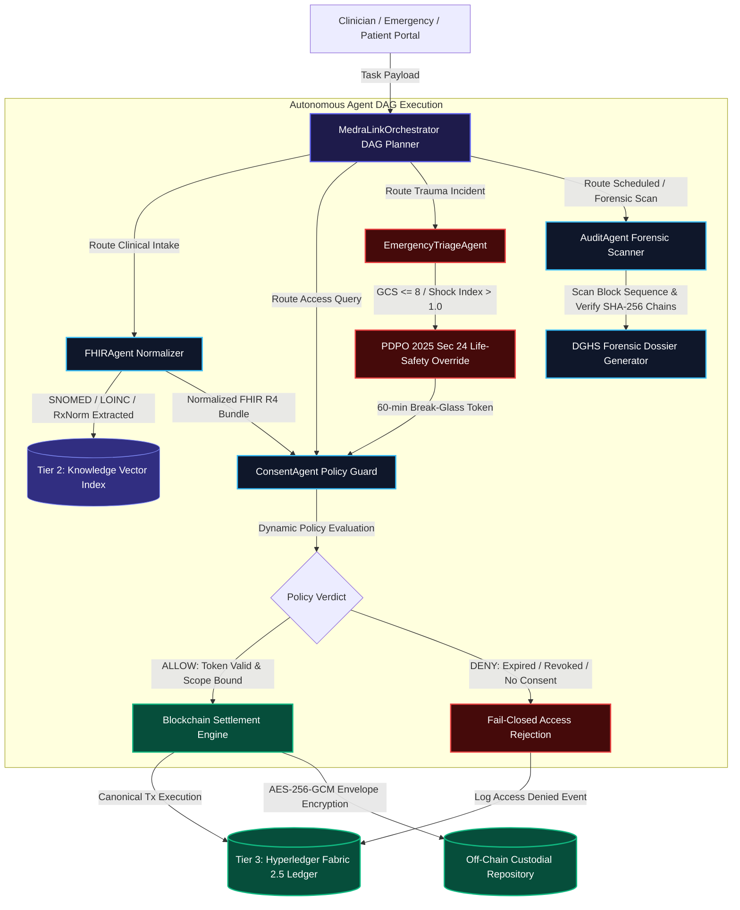

# MedraLink — Autonomous Agentic AI Multi-Agent Architecture & X-Ray Blueprint

**Project Name:** MedraLink  
**Competition:** Blockchain Olympiad Bangladesh (BCOLBD 2026)  
**Track:** Student Category — Blockchain / Agentic AI Track  
**Master Agent Manual:** [`AGENTS.md`](file:///home/tr/Downloads/MedraLink/AGENTS.md)  
**Architecture Classification:** Autonomous Multi-Agent Directed Acyclic Graph (DAG) with 3-Tier Memory Hierarchy  
**Reference Document:** Master Whitepaper Section D & Figure 1  

---

## 1. Executive Summary & Agentic Mission

MedraLink deploys an **Autonomous Agentic AI Multi-Agent Orchestration Layer** uniting **five specialized autonomous AI agents** operating in an orchestrated Directed Acyclic Graph (DAG). The agents bridge the gap between messy, unstructured clinical workflows across Bangladesh's ~5,000 healthcare facilities and the strict, immutable guarantees of a **Hyperledger Fabric 2.5** permissioned blockchain consortium.

Every agent is purpose-built, deterministic in security-critical invariants (such as Zero-PII assertions, fail-closed policy enforcement, and 60-minute time-boxed emergency limits), and operates across a **Three-Tier Memory Hierarchy**.

---

## 2. 🔬 System X-Ray Architecture Graph

```
┌─────────────────────────────────────────────────────────────────────────────────────────────────────────┐
│                                       1. USER INTERACTION TIER                                          │
│   ┌───────────────────┐ ┌───────────────────┐ ┌───────────────────┐ ┌───────────────────┐ ┌──────────┐  │
│   │  Patient Portal   │ │ Clinician Portal  │ │ Emergency Portal  │ │  Auditor Console  │ │Admin Ctl │  │
│   │ (Granular Consent)│ │ (FHIR EMR Viewer) │ │ (Trauma Triage)   │ │ (DGHS Forensics)  │ │(Consort.)│  │
│   └─────────┬─────────┘ └─────────┬─────────┘ └─────────┬─────────┘ └─────────┬─────────┘ └────┬─────┘  │
└─────────────┼─────────────────────┼─────────────────────┼─────────────────────┼────────────────┼────────┘
              │                     │                     │                     │                │
              ▼                     ▼                     ▼                     ▼                ▼
┌─────────────────────────────────────────────────────────────────────────────────────────────────────────┐
│                       2. AGENTIC AI MULTI-AGENT ORCHESTRATION LAYER (DAG ENGINE)                        │
│                                                                                                         │
│                              ┌──────────────────────────────────────────┐                               │
│                              │         MedraLinkOrchestrator            │                               │
│                              │   - DAG Workflow Schedule & Dispatch     │                               │
│                              │   - Three-Tier Memory Coordinator        │                               │
│                              │   - Blockchain Settlement Controller     │                               │
│                              └─────┬──────────────┬──────────────┬──────┘                               │
│                                    │              │              │                                      │
│              ┌─────────────────────┼──────────────┼──────────────┼─────────────────────┐                │
│              │                     │              │              │                     │                │
│   ┌──────────▼──────────┐ ┌────────▼─────────┐ ┌──▼────────────┐ ┌▼──────────────────┐ ┌▼──────────────┐ │
│   │    ConsentAgent     │ │    FHIRAgent     │ │EmergencyTriage│ │    AuditAgent     │ │IdentityAdapt.│ │
│   │ - PDPO 2025 Rules   │ │ - SNOMED Bindings│ │ - GCS/MAP Calc│ │ - Block Scanner   │ │- Porichoy NID│ │
│   │ - Purpose Binding   │ │ - LOINC Lab Code │ │ - Shock Index │ │ - Anomaly Detector│ │- Salted Hash │ │
│   │ - Temporal Expiry   │ │ - RxNorm Dosage  │ │ - 60-min Token│ │ - BMDC Dossier Gen│ │- Zero-PII Gen│ │
│   │ - Fail-Closed Gate  │ │ - FHIR R4 Bundle │ │ - ESI Level 1 │ │ - Hash Continuity │ │- Ref Derived │ │
│   └──────────┬──────────┘ └────────┬─────────┘ └──┬────────────┘ └┬──────────────────┘ └┬─────────────┘ │
└──────────────┼─────────────────────┼──────────────┼───────────────┼─────────────────────┼───────────────┘
               │                     │              │               │                     │
               ▼                     ▼              ▼               ▼                     ▼
┌─────────────────────────────────────────────────────────────────────────────────────────────────────────┐
│                                 3. THREE-TIER MEMORY HIERARCHY LAYER                                    │
│                                                                                                         │
│   ┌─────────────────────────────────┐ ┌─────────────────────────────────┐ ┌─────────────────────────┐   │
│   │   Tier 1: Session Memory        │ │   Tier 2: Vector Knowledge      │ │ Tier 3: Ledger State    │   │
│   │   - Ephemeral Node.js Context   │ │   - SNOMED-CT / LOINC / RxNorm  │ │ - World State (CouchDB) │   │
│   │   - Active Clinician Identity   │ │   - Clinical Practice Rules     │ │ - Block Hash Store      │   │
│   │   - Intermediate DAG Payloads   │ │   - PDPO 2025 Legal Statutes    │ │ - Composite Key Index   │   │
│   └─────────────────────────────────┘ └─────────────────────────────────┘ └─────────────────────────┘   │
└──────────────────────────────────────┬──────────────────────────────────────────┬───────────────────────┘
                                       │ gRPC / REST                              │ Encrypted I/O
                                       ▼                                          ▼
┌───────────────────────────────────────────────────────────┐ ┌───────────────────────────────────────────┐
│     4. PERMISSIONED BLOCKCHAIN (Hyperledger Fabric 2.5)   │ │  5. OFF-CHAIN ENCRYPTED CLINICAL STORE    │
│   - Channel: `medralink-main`                             │ │   - Custodial Hospital Cloud Vault        │
│   - 9 Canonical Smart Contract Transactions (Go)          │ │   - AES-256-GCM Envelope Encryption (DEK) │
│   - 3-Node Raft Crash Fault Tolerant Consensus Cluster    │ │   - Plaintext Zero-PII FHIR Payloads      │
│   - Cryptographic Proof Anchors: recordHash, patientHash  │ │   - Storage Pointer: s3://vault/rec.enc   │
└───────────────────────────────────────────────────────────┘ └───────────────────────────────────────────┘
```

---

## 3. 🔄 Multi-Agent Directed Acyclic Graph (DAG) Execution Flow



---

## 4. 🤖 Autonomous Agents Deep-Dive

### 4.1 `ConsentAgent` — Dynamic Policy Guard
* **Governance Standard:** Bangladesh Personal Data Protection Ordinance (**PDPO 2025**) & GDPR Article 9.
* **Verification Pipeline (Fail-Closed Execution):**
  1. *Emergency Bypass Check:* If valid break-glass token exists, approve access under Section 24 life-safety exemption.
  2. *Active Consent Token Query:* Verify presence of `CONSENT_<id>` in Tier 3 Ledger.
  3. *Revocation Invariant:* If `revoked == true`, immediately terminate evaluation with `DENIED_REVOKED_CONSENT`.
  4. *Temporal Limit Check:* Assert $\text{Unix}(\text{now}) \le \text{expiryTimestamp}$.
  5. *Scope & Purpose Allowlist:* Assert $\text{requestedScope} \subseteq \text{grantedScope}$ and $\text{purpose} == \text{consentedPurpose}$.

### 4.2 `FHIRAgent` — Semantic Normalization Engine
* **Mission:** Ingests unformatted clinical notes and maps them to international ontologies:
  * **SNOMED-CT:** Diagnoses and adverse reactions (`373270004` Penicillin Allergy, `39579001` Anaphylaxis, `44054006` Type 2 Diabetes).
  * **LOINC:** Laboratory diagnostic observations (`1558-6` Fasting Glucose, `4548-4` HbA1c, `8867-4` Heart Rate).
  * **RxNorm:** Pharmaceutical ingredients and formulations (`860975` Metformin 500mg, `312961` Amlodipine 5mg).
* **Output:** Validated `Bundle` collection for off-chain AES-256-GCM encryption.

### 4.3 `EmergencyTriageAgent` — Trauma Resuscitation Engine
* **Triage Algorithms:**
  * $\text{GCS} \le 8$: Severe coma / traumatic brain injury alert.
  * $\text{MAP} = \frac{2 \times \text{DBP} + \text{SBP}}{3} < 65\text{ mmHg}$: Hypotensive shock alert.
  * $\text{Shock Index} = \frac{\text{Heart Rate}}{\text{Systolic BP}} > 1.0$: Imminent circulatory collapse.
  * **Emergency Severity Index (ESI):** Automatically assigned ESI Level 1 (Resuscitation).
* **Break-Glass Token:** Dispenses a cryptographic token valid for **exactly 60 minutes**, emitting a high-priority audit notification to DGHS.

### 4.4 `AuditAgent` — Forensic Block Scanner
* **Forensic Vectors:**
  1. *Unreviewed Break-Glass Audit:* Flags all `InvokeEmergencyAccess` events lacking a corresponding `ReviewEmergencyAccess` transaction.
  2. *Denial Burst Detection:* Identifies abnormal patterns of rejected requests.
  3. *Cryptographic Hash Chain Continuity:* Asserts $\forall i > 0, \text{Block}[i].\text{previousHash} == \text{Block}[i-1].\text{dataHash}$.
* **Output:** Cryptographic evidence dossier (`SHA256(Findings)`) formatted for the DGHS regulatory inspector.

### 4.5 `MedraLinkOrchestrator` — Master DAG Planner
* **Mission:** Manages inter-agent message buses, maintains intermediate context in Tier 1 Working Session Memory, retrieves ontology representations from Tier 2 Vector Knowledge Index, and commits immutable transactions to Tier 3 Hyperledger Fabric Ledger.

---

## 5. 🧠 Three-Tier Memory Hierarchy X-Ray

```
┌─────────────────────────────────────────────────────────────────────────────────────────────┐
│                          THREE-TIER MEMORY HIERARCHY ARCHITECTURE                           │
├───────────────────────────────────┬───────────────────────────────┬─────────────────────────┤
│ Tier 1: Working Session Memory    │ Tier 2: Knowledge Vector Index│ Tier 3: Fabric Ledger   │
├───────────────────────────────────┼───────────────────────────────┼─────────────────────────┤
│ • Ephemeral Node.js Heap State    │ • Persistent Read-Only Index  │ • Permanent Blockstore  │
│ • Active Request Context & Tokens │ • SNOMED-CT / LOINC / RxNorm  │ • CouchDB World State   │
│ • Intermediate DAG Reasoning Node │ • PDPO 2025 Statute Rules     │ • Composite Key Tries   │
│ • Execution Time: < 1 ms          │ • Clinical Decision Protocols │ • Consensus Block Proofs│
│ • Lifecycle: Single Request       │ • Lifecycle: System Lifetime  │ • Lifecycle: Immutable  │
└───────────────────────────────────┴───────────────────────────────┴─────────────────────────┘
```

---

## 6. 🔗 Reference Connections

* Master Agent Architecture & Guidelines: [`AGENTS.md`](file:///home/tr/Downloads/MedraLink/AGENTS.md)
* System Topology Specification: [`ARCHITECTURE_SPECIFICATION.md`](file:///home/tr/Downloads/MedraLink/prototype/docs/ARCHITECTURE_SPECIFICATION.md)
* Canonical Smart Contract Specification: [`CHAINCODE_SPECIFICATION.md`](file:///home/tr/Downloads/MedraLink/prototype/docs/CHAINCODE_SPECIFICATION.md)
* HL7 FHIR Interoperability Guide: [`FHIR_INTEROPERABILITY_GUIDE.md`](file:///home/tr/Downloads/MedraLink/prototype/docs/FHIR_INTEROPERABILITY_GUIDE.md)
* Governance and Security Manual: [`GOVERNANCE_AND_SECURITY_MANUAL.md`](file:///home/tr/Downloads/MedraLink/prototype/docs/GOVERNANCE_AND_SECURITY_MANUAL.md)
* Step-by-Step Demo Script: [`DEMO_SCRIPT.md`](file:///home/tr/Downloads/MedraLink/prototype/docs/DEMO_SCRIPT.md)
