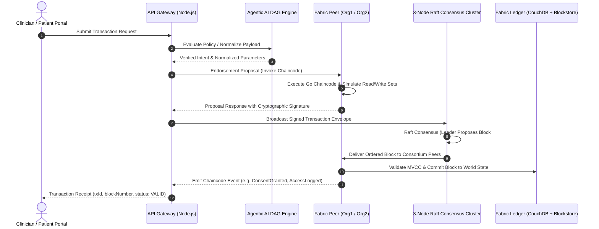

# MedraLink — System Architecture Specification & X-Ray Blueprint

**Project Name:** MedraLink  
**Competition:** Blockchain Olympiad Bangladesh (BCOLBD 2026)  
**Track:** Student Category — Blockchain / Agentic AI Track  
**Master Agent Manual:** [`AGENTS.md`](file:///home/tr/Downloads/MedraLink/AGENTS.md)  
**AI Architecture Reference:** [`AGENTIC_AI_ARCHITECTURE.md`](file:///home/tr/Downloads/MedraLink/prototype/docs/AGENTIC_AI_ARCHITECTURE.md)  
**Architecture Classification:** Multi-Tier Hybrid Permissioned Blockchain & Encrypted Off-Chain Clinical Data Interoperability Network  
**Reference Document:** Whitepaper Section D & Figure 1  

---

## 1. Executive Summary

MedraLink is an enterprise-grade healthcare data interoperability and audit provenance system designed to overcome record fragmentation across the pluralistic healthcare ecosystem of Bangladesh (DGHS public facilities and ~5,000 private clinics/diagnostic centers). 

The platform separates **data trust, consent enforcement, and audit non-repudiation** (handled on-chain via **Hyperledger Fabric 2.5**) from **heavy clinical payload storage** (handled off-chain via **AES-256-GCM encrypted HL7 FHIR R4 repositories**), fully orchestrated by an **Agentic AI Multi-Agent Directed Acyclic Graph (DAG)**.

---

## 2. 🔬 System Topology X-Ray Graph

```
┌─────────────────────────────────────────────────────────────────────────────────────────────────────────┐
│                                       1. USER INTERACTION TIER                                          │
│   ┌───────────────────┐ ┌───────────────────┐ ┌───────────────────┐ ┌───────────────────┐ ┌──────────┐  │
│   │  Patient Portal   │ │ Clinician Portal  │ │ Emergency Portal  │ │  Auditor Console  │ │Admin Ctl │  │
│   │ (Granular Consent)│ │ (FHIR EMR Viewer) │ │ (Trauma Triage)   │ │ (DGHS Forensics)  │ │(Consort.)│  │
│   └─────────┬─────────┘ └─────────┬─────────┘ └─────────┬─────────┘ └─────────┬─────────┘ └────┬─────┘  │
└─────────────┼─────────────────────┼─────────────────────┼─────────────────────┼────────────────┼────────┘
              │                     │                     │                     │                │
              ▼                     ▼                     ▼                     ▼                ▼
┌─────────────────────────────────────────────────────────────────────────────────────────────────────────┐
│                       2. AGENTIC AI MULTI-AGENT ORCHESTRATION LAYER (DAG ENGINE)                        │
│                                                                                                         │
│                              ┌──────────────────────────────────────────┐                               │
│                              │         MedraLinkOrchestrator            │                               │
│                              │   - DAG Workflow Schedule & Dispatch     │                               │
│                              │   - Three-Tier Memory Coordinator        │                               │
│                              │   - Blockchain Settlement Controller     │                               │
│                              └─────┬──────────────┬──────────────┬──────┘                               │
│                                    │              │              │                                      │
│              ┌─────────────────────┼──────────────┼──────────────┼─────────────────────┐                │
│              │                     │              │              │                     │                │
│   ┌──────────▼──────────┐ ┌────────▼─────────┐ ┌──▼────────────┐ ┌▼──────────────────┐ ┌▼──────────────┐ │
│   │    ConsentAgent     │ │    FHIRAgent     │ │EmergencyTriage│ │    AuditAgent     │ │IdentityAdapt.│ │
│   │ - Dynamic PDPO Rules│ │ - SNOMED Bindings│ │ - GCS/MAP Calc│ │ - Block Scanner   │ │- Porichoy NID│ │
│   │ - Purpose Binding   │ │ - LOINC Lab Code │ │ - Shock Index │ │ - Anomaly Detector│ │- Salted Hash │ │
│   │ - Temporal Expiry   │ │ - RxNorm Dosage  │ │ - 60-min Token│ │ - BMDC Dossier Gen│ │- Zero-PII Gen│ │
│   │ - Fail-Closed Gate  │ │ - FHIR R4 Bundle │ │ - ESI Level 1 │ │ - Hash Continuity │ │- Ref Derived │ │
│   └──────────┬──────────┘ └────────┬─────────┘ └──┬────────────┘ └┬──────────────────┘ └┬─────────────┘ │
└──────────────┼─────────────────────┼──────────────┼───────────────┼─────────────────────┼───────────────┘
               │                     │              │               │                     │
               ▼                     ▼              ▼               ▼                     ▼
┌─────────────────────────────────────────────────────────────────────────────────────────────────────────┐
│                                 3. THREE-TIER MEMORY HIERARCHY LAYER                                    │
│                                                                                                         │
│   ┌─────────────────────────────────┐ ┌─────────────────────────────────┐ ┌─────────────────────────┐   │
│   │   Tier 1: Session Memory        │ │   Tier 2: Vector Knowledge      │ │ Tier 3: Ledger State    │   │
│   │   - Ephemeral Node.js Context   │ │   - SNOMED-CT / LOINC / RxNorm  │ │ - World State (CouchDB) │   │
│   │   - Active Clinician Identity   │ │   - Clinical Practice Rules     │ │ - Block Hash Store      │   │
│   │   - Intermediate DAG Payloads   │ │   - PDPO 2025 Legal Statutes    │ │ - Composite Key Index   │   │
│   └─────────────────────────────────┘ └─────────────────────────────────┘ └─────────────────────────┘   │
└──────────────────────────────────────┬──────────────────────────────────────────┬───────────────────────┘
                                       │ gRPC / REST                              │ Encrypted I/O
                                       ▼                                          ▼
┌───────────────────────────────────────────────────────────┐ ┌───────────────────────────────────────────┐
│     4. PERMISSIONED BLOCKCHAIN (Hyperledger Fabric 2.5)   │ │  5. OFF-CHAIN ENCRYPTED CLINICAL STORE    │
│   - Channel: `medralink-main`                             │ │   - Custodial Hospital Cloud Vault        │
│   - 9 Canonical Smart Contract Transactions (Go)          │ │   - AES-256-GCM Envelope Encryption (DEK) │
│   - 3-Node Raft Crash Fault Tolerant Consensus Cluster    │ │   - Plaintext Zero-PII FHIR Payloads      │
│   - Cryptographic Proof Anchors: recordHash, patientHash  │ │   - Storage Pointer: s3://vault/rec.enc   │
└───────────────────────────────────────────────────────────┘ └───────────────────────────────────────────┘
```

---

## 3. 🔐 On-Chain vs. Off-Chain Cryptographic Pipeline X-Ray

```
[ CLINICAL PAYLOAD / UNSTRUCTURED NOTE ]
                   │
                   ▼ (FHIRAgent Semantic Normalization)
     [ HL7 FHIR R4 Bundle (JSON) ]
                   │
                   ▼ (AES-256-GCM Envelope Encryption with Unique DEK)
    ┌──────────────┴──────────────┐
    │                             │
    ▼                             ▼
[ Ciphertext Payload ]      [ recordHash = SHA256(Ciphertext) ]
    │                       [ opaquePointerHash = SHA256(s3://...) ]
    ▼                             │
(Stored Off-Chain in              ▼ (CreateRecordReference)
 Custodial Hospital Vault)   [ Anchored on Hyperledger Fabric Ledger ]
```

| Dimension | On-Chain (Hyperledger Fabric Ledger) | Off-Chain (Custodial Repositories) |
|---|---|---|
| **Identity Data** | Pseudonymous `patientRefHash = SALTED_SHA256(HealthId + DOB)` | Demographics, Patient Name, Phone, Address (Encrypted) |
| **National ID (NID)** | **NEVER STORED** (Discarded by adapter after hash derivation) | Stored only in external government NID registry |
| **Clinical Records** | Cryptographic integrity `recordHash = SHA256(ciphertext)` + pointer hash | Plaintext FHIR R4 Resource Bundles encrypted with AES-256-GCM |
| **Consent Model** | Granular scope tokens, purpose allowlist, expiration timestamp, status | Detailed patient-signed legal agreement forms |
| **Audit Trails** | Complete immutable sequence of every access attempt & emergency event | System debug telemetry and access analytics |
| **Right to Erasure** | Cryptographic hash retained as non-repudiable tombstone | Ciphertext and encryption keys permanently deleted |

---

## 4. ⚡ Transaction Execution & Raft Consensus Pipeline



---

## 5. 🏛️ Consortium Organizations & Node Topologies

The pilot deployment configures a **3+1 Consortium** topology:

### 5.1 Org1MSP — Pilot Hospital A (Tertiary Public / Academic Facility)
- **Nodes:** 1 Peer (`peer0.org1`), 1 CA (`ca.org1`), 1 Raft Orderer (`orderer1`).
- **State Database:** CouchDB instance `couchdb0` (Port 5984).
- **Role:** Endorses patient registration, consent grants, and records generated at Hospital A.

### 5.2 Org2MSP — Pilot Hospital B (Private Hospital & Diagnostic Center)
- **Nodes:** 1 Peer (`peer0.org2`), 1 CA (`ca.org2`), 1 Raft Orderer (`orderer2`).
- **State Database:** CouchDB instance `couchdb1` (Port 6984).
- **Role:** Endorses lab diagnostic reports, emergency department break-glass events, and external access requests.

### 5.3 Org3MSP — Medralink Consortium Operator
- **Nodes:** 1 Shadow Peer (`peer0.org3`), 1 CA (`ca.org3`), 1 Raft Orderer (`orderer3`).
- **State Database:** CouchDB instance `couchdb2` (Port 7984).
- **Role:** Maintains gateway routing, ordering service orchestration, and network health monitoring. Does not endorse patient consent.

### 5.4 OrgAuditorMSP — Regulatory Observer (DGHS / MIS Bangladesh)
- **Nodes:** 1 Read-Only Audit Peer (`peer0.orgauditor`), 1 CA (`ca.orgauditor`).
- **State Database:** CouchDB instance `couchdb3` (Port 8984).
- **Role:** Non-endorsing audit replica. Receives all ledger blocks via gossip and participates in `ReviewEmergencyAccess` workflows.

---

## 6. 🔗 Reference Connections

* Master Agent Architecture & Guidelines: [`AGENTS.md`](file:///home/tr/Downloads/MedraLink/AGENTS.md)
* Agentic AI Architecture: [`AGENTIC_AI_ARCHITECTURE.md`](file:///home/tr/Downloads/MedraLink/prototype/docs/AGENTIC_AI_ARCHITECTURE.md)
* Smart Contract Technical Specification: [`CHAINCODE_SPECIFICATION.md`](file:///home/tr/Downloads/MedraLink/prototype/docs/CHAINCODE_SPECIFICATION.md)
* FHIR Interoperability Guide: [`FHIR_INTEROPERABILITY_GUIDE.md`](file:///home/tr/Downloads/MedraLink/prototype/docs/FHIR_INTEROPERABILITY_GUIDE.md)
* Governance & Security Manual: [`GOVERNANCE_AND_SECURITY_MANUAL.md`](file:///home/tr/Downloads/MedraLink/prototype/docs/GOVERNANCE_AND_SECURITY_MANUAL.md)
* Prototype Demo Script: [`DEMO_SCRIPT.md`](file:///home/tr/Downloads/MedraLink/prototype/docs/DEMO_SCRIPT.md)
