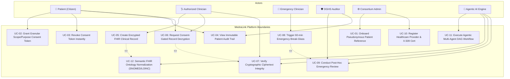
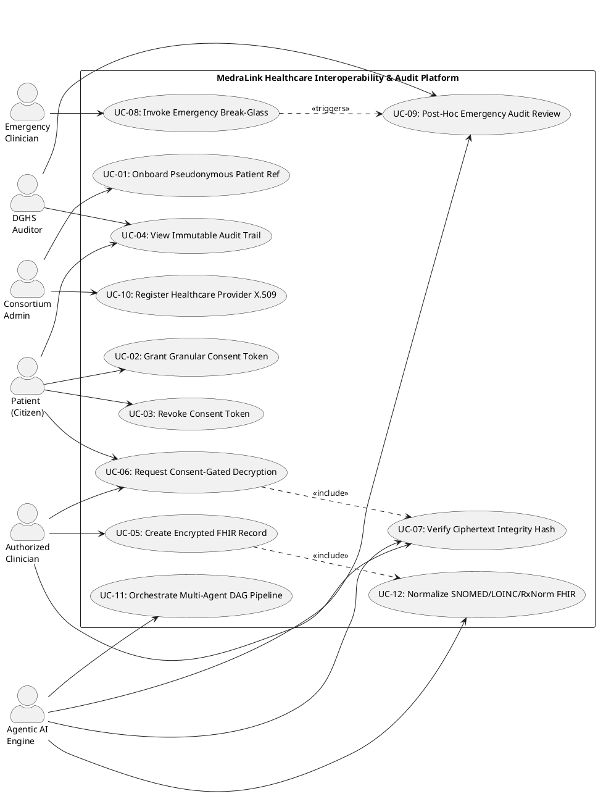

# 01 — MedraLink UML Use Case Diagram

This document models the functional requirements, actor boundaries, and system interactions across the MedraLink platform.

---

## 👥 Actors

1. **👤 Patient (Citizen Data Subject):** Governs consent lifecycle, accesses private health records vault, monitors audit access log.
2. **🩺 Authorized Clinician:** Requests consent-gated record access, uploads AES-256-GCM encrypted FHIR bundles, anchors hash proofs.
3. **🚨 Emergency Clinician:** Triggers life-safety emergency break-glass override under time-boxed tokens.
4. **🛡️ DGHS Compliance Auditor:** Performs post-hoc forensic ledger verification, evaluates emergency break-glass justifications, flags disciplinary actions.
5. **⚙️ Consortium Admin:** Registers institutional healthcare providers, onboards pseudonymous patient references, bootstraps consortium state.
6. **🤖 Autonomous AI Agents (`ConsentAgent`, `FHIRAgent`, `EmergencyTriageAgent`, `AuditAgent`, `MedraLinkOrchestrator`):** Automates DAG workflows, policy evaluation, terminology normalization, and anomaly detection.

---

## 📊 UML Use Case Diagram (Mermaid)

---

## 📋 PlantUML Source Code (`use_case.puml`)

