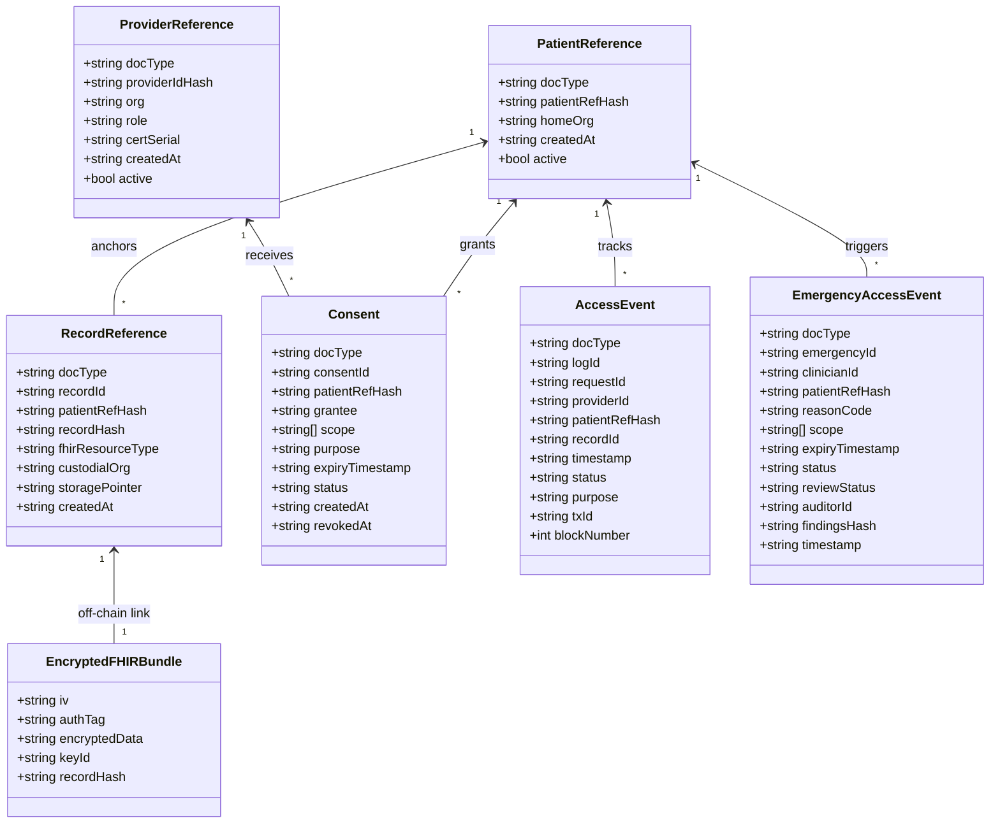
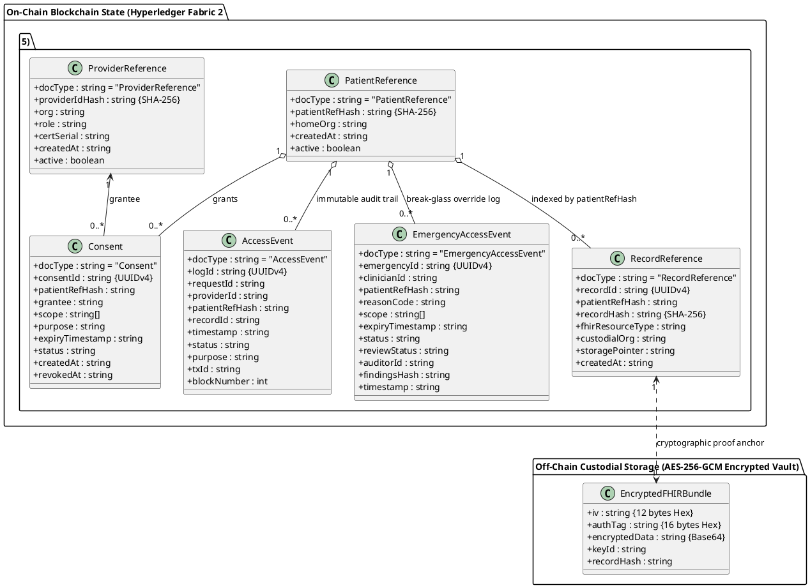

# 02 — MedraLink UML Class & Data Model Diagram

This document models the on-chain Hyperledger Fabric state structures, the off-chain FHIR R4 clinical entities, and their domain relationships.

---

## 📊 UML Class Diagram (Mermaid)

---

## 📋 PlantUML Source Code (`class_diagram.puml`)

