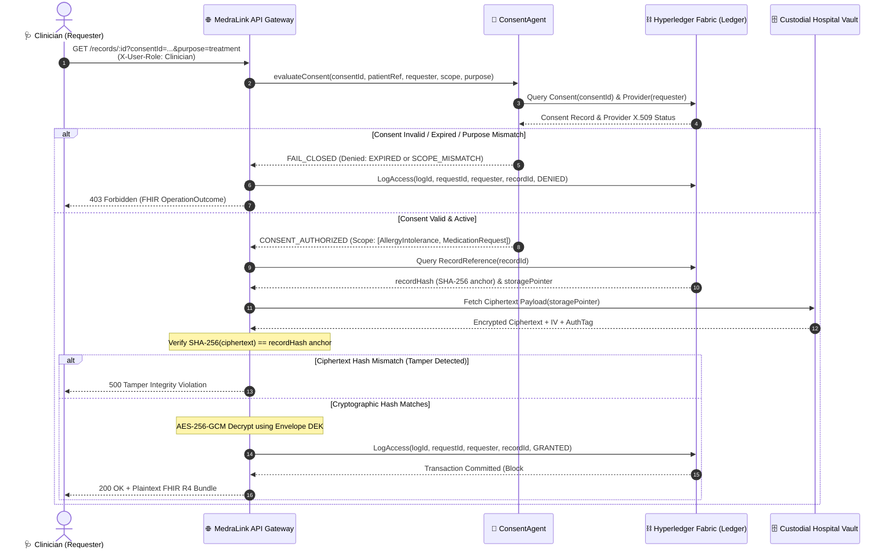
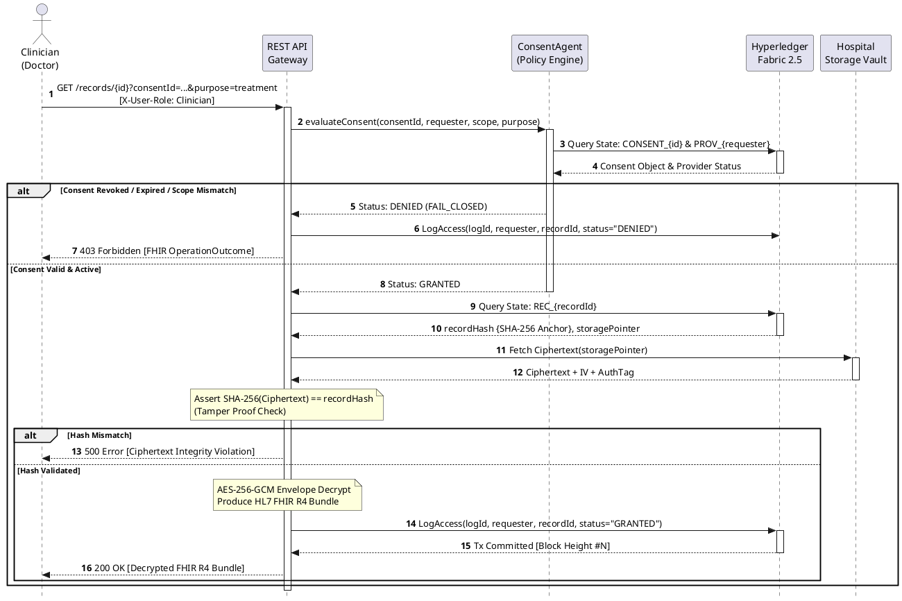

# 03 — MedraLink UML Sequence Diagram: Consent-Gated Access & Decryption

This document models the end-to-end flow of dynamic consent policy evaluation, tamper verification, off-chain decryption, and immutable on-chain access logging.

---

## 📊 UML Sequence Diagram (Mermaid)

---

## 📋 PlantUML Source Code (`sequence_consent.puml`)

