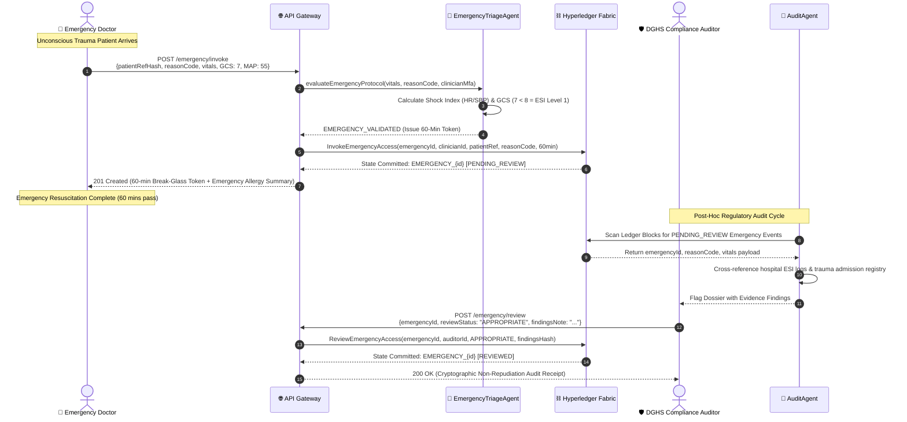
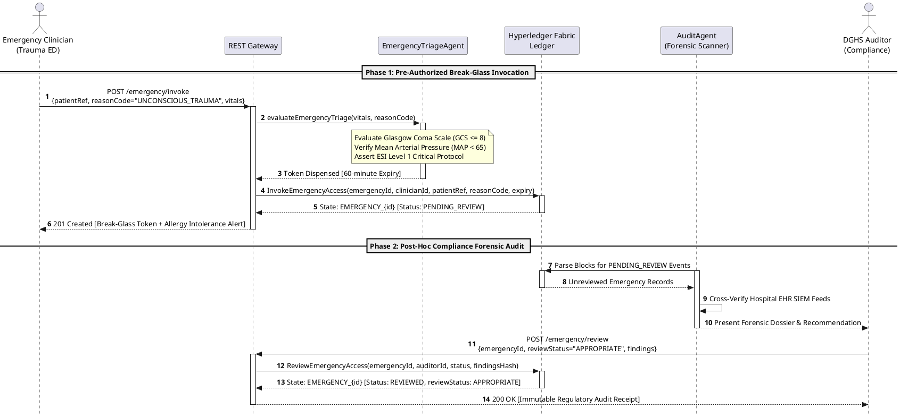

# 04 — MedraLink UML Sequence Diagram: Emergency Break-Glass & Post-Hoc Audit

This document models the life-safety emergency break-glass sequence, triage agent validation, 60-minute token dispensation, and post-hoc DGHS auditor review.

---

## 📊 UML Sequence Diagram (Mermaid)

---

## 📋 PlantUML Source Code (`sequence_emergency.puml`)

