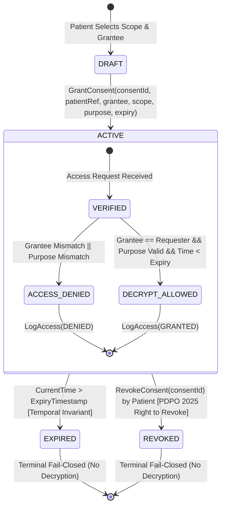
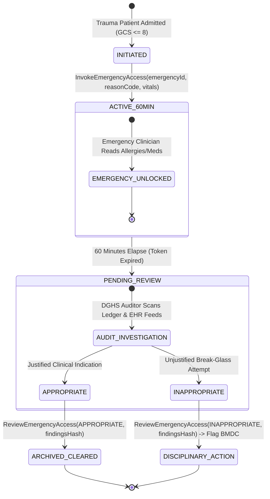
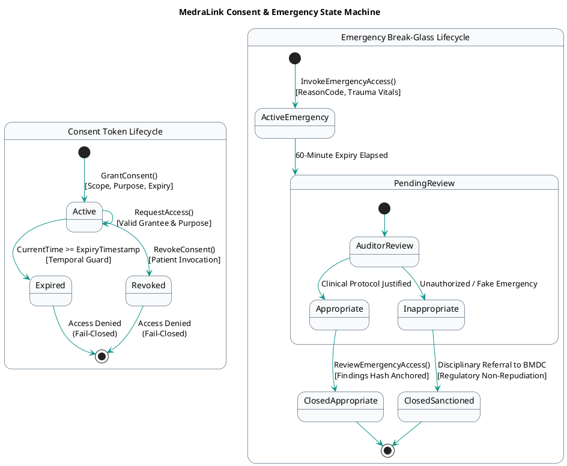

# 05 — MedraLink UML State Machine Diagram: Consent & Emergency Lifecycles

This document models the lifecycle states, transitions, guard conditions, and fail-closed termination of Consent Tokens and Emergency Break-Glass events on the Hyperledger Fabric ledger.

---

## 📊 1. Consent Token State Machine (Mermaid)

---

## 📊 2. Emergency Break-Glass State Machine (Mermaid)

---

## 📋 PlantUML Source Code (`state_machine.puml`)

