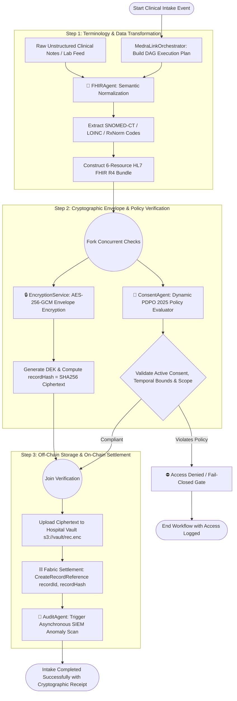
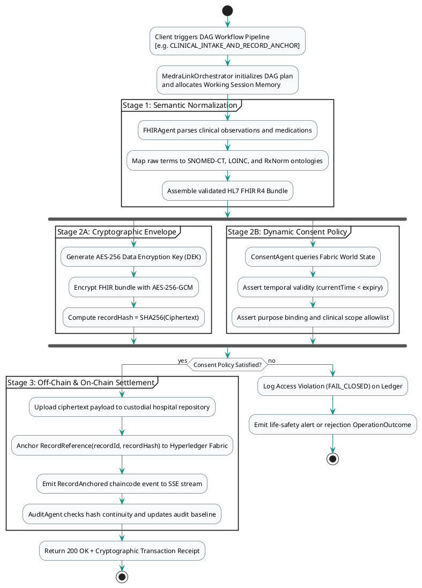

# 06 — MedraLink UML Activity Diagram: Multi-Agent DAG Workflow Execution

This document models the Directed Acyclic Graph (DAG) workflow scheduling, parallel agent execution, and blockchain state settlement handled by `MedraLinkOrchestrator`.

---

## 📊 UML Activity Diagram (Mermaid)

---

## 📋 PlantUML Source Code (`activity_dag.puml`)

