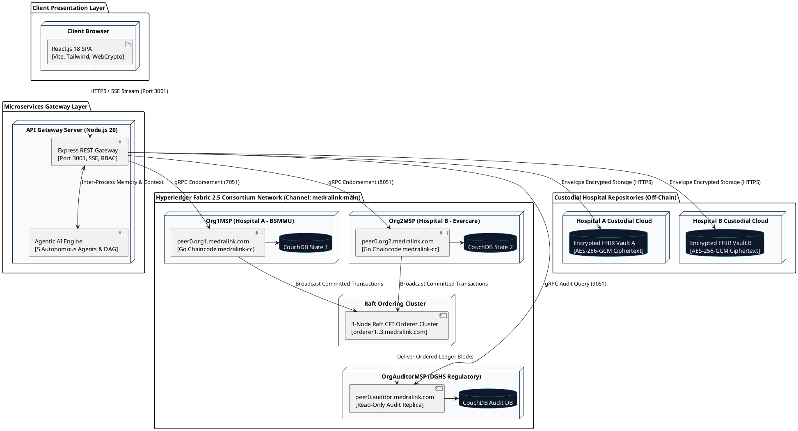

# 07 — MedraLink UML Deployment Diagram: 4-Org Consortium Topology

This document models the physical and containerized node topology of the MedraLink 4-Organization permissioned consortium network.

---

## 📊 UML Deployment Diagram (Mermaid)

```mermaid
graph TB
    subgraph ClientTier["1. User & Client Tier"]
        Browser["🖥️ React.js 18 Web SPA<br/>(Tailwind CSS, Fluid Typography)"]
        MobileApp["📱 Patient Health Card App<br/>(Web Crypto, QR Pseudonym)"]
    end

    subgraph APITier["2. API Gateway & Agent Layer"]
        Gateway["🌐 MedraLink REST Gateway (Node.js 20)<br/>- Port: 3001<br/>- SSE Event Stream<br/>- Express RBAC & FHIR Adapters"]
        AgentEngine["🤖 Agentic AI Multi-Agent Engine<br/>- ConsentAgent, FHIRAgent<br/>- EmergencyTriageAgent, AuditAgent<br/>- MedraLinkOrchestrator"]
    end

    subgraph FabricConsortium["3. Hyperledger Fabric 2.5 Consortium Network"]
        subgraph Org1["Org1MSP (BSMMU Hospital A)"]
            Peer1["peer0.org1.medralink.com<br/>- Endorser + Anchor<br/>- Go Chaincode Engine"]
            Couch1[("CouchDB State DB 1")]
            CA1["ca.org1.medralink.com<br/>(X.509 MSP)"]
            Peer1 --- Couch1
        end

        subgraph Org2["Org2MSP (Evercare Hospital B)"]
            Peer2["peer0.org2.medralink.com<br/>- Endorser<br/>- Go Chaincode Engine"]
            Couch2[("CouchDB State DB 2")]
            CA2["ca.org2.medralink.com<br/>(X.509 MSP)"]
            Peer2 --- Couch2
        end

        subgraph Org3["Org3MSP (National Health Gateway)"]
            Peer3["peer0.org3.medralink.com<br/>- Endorser & Router"]
            Couch3[("CouchDB State DB 3")]
            Peer3 --- Couch3
        end

        subgraph OrgAuditor["OrgAuditorMSP (DGHS Regulatory)"]
            PeerAuditor["peer0.auditor.medralink.com<br/>- Read-Only Audit Replica"]
            CouchAuditor[("CouchDB Audit DB")]
            PeerAuditor --- CouchAuditor
        end

        subgraph OrderingCluster["Raft Ordering Service"]
            Orderer1["orderer1.medralink.com<br/>(Raft CFT Consenter)"]
            Orderer2["orderer2.medralink.com<br/>(Raft CFT Consenter)"]
            Orderer3["orderer3.medralink.com<br/>(Raft CFT Consenter)"]
        end
    end

    subgraph StorageTier["4. Off-Chain Custodial Storage Repositories"]
        VaultA["🗄️ Hospital A EMR Storage<br/>(AES-256-GCM Encrypted FHIR)"]
        VaultB["🗄️ Hospital B EMR Storage<br/>(AES-256-GCM Encrypted FHIR)"]
    end

    Browser -->|HTTP / SSE| Gateway
    MobileApp -->|HTTP REST| Gateway
    Gateway <--> AgentEngine
    Gateway -->|gRPC / Fabric SDK| Peer1
    Gateway -->|gRPC / Fabric SDK| Peer2
    Gateway -->|HTTPS Encrypted Payloads| VaultA
    Gateway -->|HTTPS Encrypted Payloads| VaultB

    Peer1 --- Orderer1
    Peer2 --- Orderer1
    Peer3 --- Orderer2
    PeerAuditor --- Orderer3
```

---

## 📋 PlantUML Source Code (`deployment_topology.puml`)

